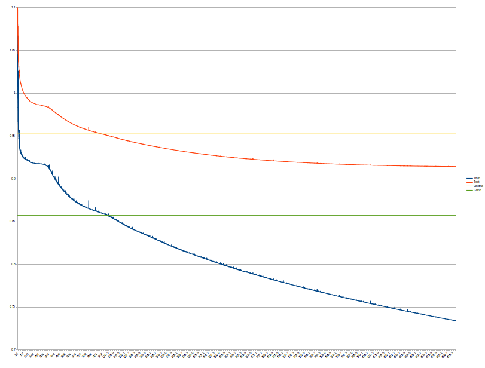

# Netflix Competition

Data for netflix competition can still be dowloaded from [Netflix Prize Data Set Academic Torrent](https://academictorrents.com/details/9b13183dc4d60676b773c9e2cd6de5e5542cee9a) or from [Kaggle's Netflix Prize Data Set](https://www.kaggle.com/netflix-inc/netflix-prize-data) (but they are in different format, so you will have to change code for loading). As "the grand prize set" is not available, I am using as a test probe set, which is removed from training data to make it somewhat inline with the competition. Description for [matrix factorization is on wiki](https://en.wikipedia.org/wiki/Matrix_factorization_(recommender_systems)). I wanted to try this using [pyopencl](https://pypi.org/project/pyopencl/) this time (speed up in comparison with python execution is huge - which was expected as it runs on NVIDIA's RTX 3090). [Results of Netflix competition](https://netflixprize.com/leaderboard.html) (Cinematch score was 0.9525, grand prize score was 0.85725 - 10% improvement upon cinematch).

Number of users: 480,189

Number of movies: 17,770

Number of training ratings: 99,072,112

Number of testing ratings: 1,408,395

For dimension N=500 - quad 'python3 main_quad.py' (best score 0.9145 for testing set, which is ~3.99 % improvement over Cinematch score)

For dimension N=500 - matrix factorization 'python3 main.py' (best score on test 0.9288, which is ~2.49 % improvement over cinematch score):

For the second method 'python3 main_matrix.py' - progress is slow (best score 0.9415, which is ~1.16 % improvement over cinematch score; Nm=10, Nu=50):

